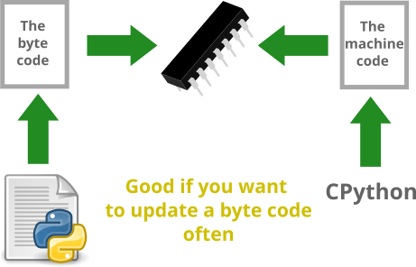

# About another translators

## SY_Py2C

This SY_Py2C-translator makes a clear and useful C-code:

It looks like C-code made by hands:

## MicroPython

The MicroPython or CircuitPython loads the python-interpreter to inside your microcontroller:

It's useful only if you plan to update a byte-code often. It's ok for big microcontrollers.

## AI-translators

Any artificial intelligence translator are not your bro: 

Somebody have to make more smart AI.

## Source pictures:

- https://commons.wikimedia.org/wiki/File:Text-x-python.svg
- https://commons.wikimedia.org/wiki/File:C_Programming_Language.svg
- https://commons.wikimedia.org/wiki/File:Schema_eines_ICs.svg
- https://commons.wikimedia.org/wiki/File:Document_arrow_green.svg
